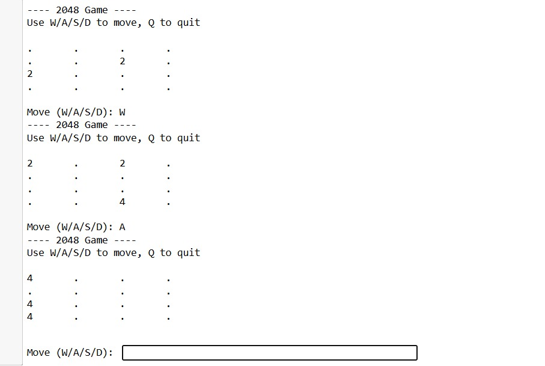

# 2048_Game
Python 

##  Overview
This is a fully playable 2048 game built using the Python programming language.
The project replicates the popular puzzle game where you slide numbered tiles, combine matching values, and aim to reach the 2048 tile.

---

## Output

    

